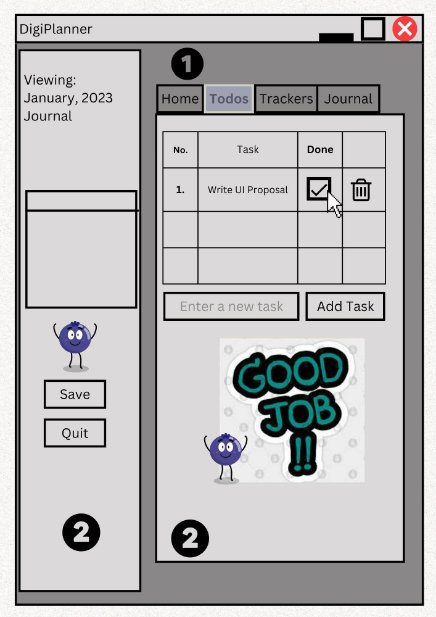
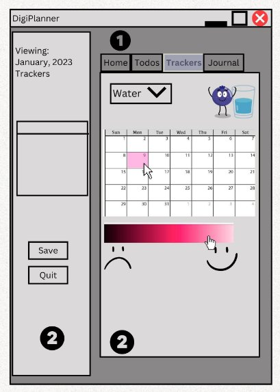
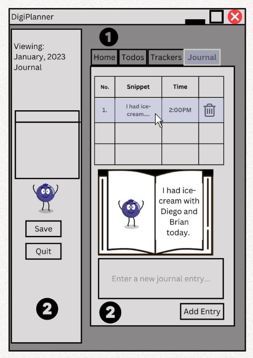
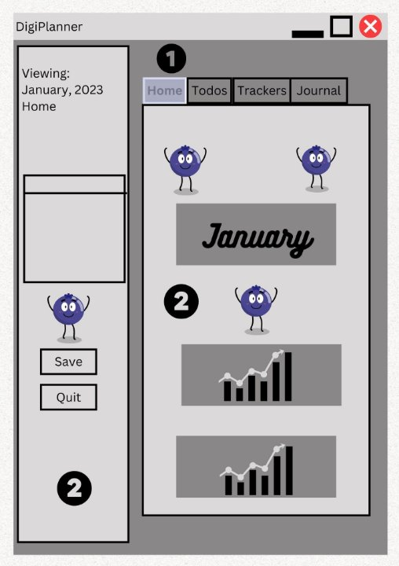
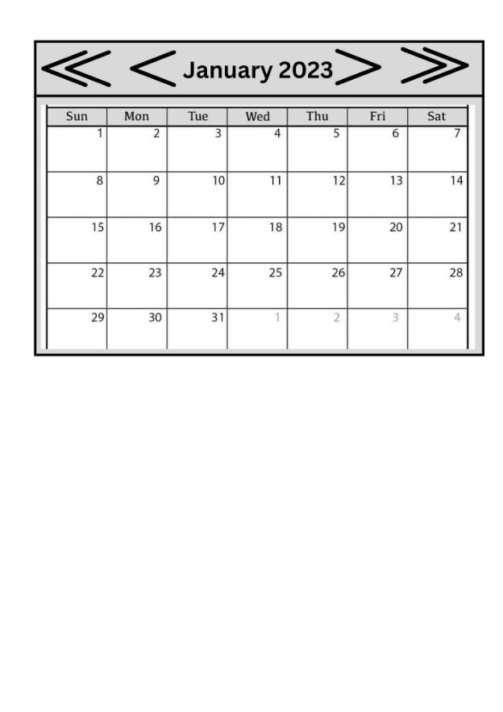

**Project Title: DigiPlanner**

Authors: Diego Abanto Ibarguen, Brian Dion, Sara Alam 

Course: COSC480E Intro to UI

Instructor: E. Fourquet

**Statement**

The DigiPlanner app is a digital form of a store-bought planner, with different sections for different purposes like task-planning, habit-tracking, short notes etc. Benefits beyond a paper planner include: 

**i.** the aesthetic value added by digital images and gifs and 

**ii.** a compact, paperless way to store the information recorded.

The user interface will be built using javafx components and the backend will be written in java.

**Technical Outline**

The app will consist of 8 java classes, 4 of which will be objects designed to store the information. Each of these 5 objects will correspond to a display in the app, and will create and maintain instances of their own javafx components.The remaining class will be the main app class integrating the 5 objects and maintaining the main javafx Stage of the app. File i/o code will be written separately from these classes. The following paragraphs describe the parts of the 8 classes these directly affect user experience:

Note: In all of the layout images below, the region marked 1 is where a decorative gif would be displayed (behind the tabpane), and the regions marked 2 would have the same solid color background. Currently, they are shades of gray but this does not represent the final colors that will be used. The spots where the joyful blueberry appears are reserved for images of a chosen mascot with different expressions on its face. Currently, the mascot is set to be a blueberry.

1. To-do.java

This class will create and maintain the TableView of tasks added to the user, with a column for the delete button. It will also contain the Textfield for adding new tasks and the add button that adds the new task to the listview.

Note: The empty box below the "Viewing: January..." text is the calendar view allowing the user to navigate from day to day. A detailed picture of this calendar view, along with its navigation buttons, is shown below under MonthlyHome.java.

2. Tracker.java

This class will create and maintain the colorable Labels for each day of the month on a flowpane resembling a calendar. It will also hold the color-picker for the tracker.

3. TrackerList.java

This class will also hold the drop down menu that is the main way to navigate between trackers of the month. The “previous month” and “next month” buttons will help navigate to other months without requiring the user to go back to the monthly home page first.

4. Journal.java

This class will create and maintain the TextArea for entering journal entries, the add button for adding the entry to the list of journal entries for the day.

5. JournalList.java

This class will create and maintain the journal objects for each day of the month and store them in an ArrayList. It will create the “previous day” and “next day” buttons to navigate between the days of the month.

6. MonthlyHome.java

This will be an introduction to the month, displaying graphs that summarize the tracker information and possibly the task-completion rate for the month.

The calendar view would look as follows:

The "<<" and ">>" buttons navigate to the previous and following year's tabpanes respectively. The "<" and ">" buttons navigate to the previous and next month's tabpanes respectively.

7. SpreadBundle.java

This class will create an object that bundles the aforementioned objects together for a specific month. This will not hold any significant event-generating component.

8. DigiPlanner.java

This class will create the SpreadBundle objects for each month, the calendar view that allows the user to navigate between days of the year, the Save button for save the current state of the planner without quitting and the quit button. This will also load all the images and gifs for decorating each month’s objects.

**Aesthetic Elements**

The decorations referred to in the layouts above (regions 1, 2 and blueberry mascot markers) include the following:

1. The VBox created by DigiPlanner.java and the TabPane created by SpreadBundle.java for each month will share a color. This color will be different for each month and will be chosen to complement the monthly gif displayed behind the tabpane.
2. Mascot images with variations of a custom character. For the trackers, the mascot would be depicted doing something related to the tracker. For example, for the Water tracker, the mascot would be depicted drinking water.
3. Mascot images with different emotions/expressions like sadness, happiness, thinking etc. These will be used for alerts/ error messages/ small encouraging messages displayed as user events occur.
4. The monthly gifs will be made using [online tool](https://ezgif.com/optimize/ezgif-5-d7f46a0b5d.gif) and 12 sets of manually made images. The images within the same set will be slightly different from one another, so as to create the illusion of movement.

**Objectives**

1. Create a global calendar view to allow the user to navigate based on year, month, and day with a menu on the left hand side.

\*Objectives 2-4 refer to tabs in the tabpane of every SpreadBundle object (there will be one per month).

2. Have a tab called journal entries that displays entries on the image of a book and will allow the user to ‘flip’ through the book.
   
3. Have a tab called trackers, with the calendar view of labels that the user can recolor to rate their day based on 5 different metrics: water, workout, sleep, stress, and study.
4. Make the color picker a gradient formed using different hues of the same color. Allow the user to pick from many different hues.

5. Have a tab called home, which allows the user to view a summary of a certain month’s status in the form of a graph, as well as icons to instruct about what all the tabs are for.
   
6. Make images of a mascot corresponding to each of the five trackers water, workout, stress, study and sleep.

For example, a possible images for the Water tracker would be:

7. Make images of a mascot to display for each end of the tracker color slider. Also create images of the mascot speaking, for display when the program displays text to the user like errors, response to checking off tasks on the todo-list etc. For example:

8. Make 12 background gifs that are displayed based on which month it is. The TabPane for each month will sit on top of this gif background.
   
9.  Create a file IO hierarchy of all text files to read and write to. The largest folder will be that for each year (due to the scope of this project, we plan to only create this for the current year for the current version of the application). It will contain a folder for each month. Each month’s folder will contain text files to store journal entries, tracker information and daily todo-lists for the month.Each of these files will be created using specific naming conventions and formats, to aid the process of retrieving the information when the application is started in the future.
    
10. Implement delete and save button handlers to different keypress events like Ctrl+S and Delete, so that the user can perform those actions in multiple ways, regardless of the tab of the tabpane that is being displayed currently.

**Bibliography**

1. <https://stackoverflow.com/questions/42350145/date-picker-selected-cell-css> (for changing date at top of screen)
2. <https://stackoverflow.com/questions/15189851/javafx-vertical-slider> (can be used for objective, in trackers)
3. [18 Slider (Release 8) (oracle.com)](https://docs.oracle.com/javase/8/javafx/user-interface-tutorial/slider.htm#CCHFBJCH) (can be used for implementing the slider)
4. [11 Scroll Pane (Release 8) (oracle.com)](https://docs.oracle.com/javase/8/javafx/user-interface-tutorial/scrollpane.htm#CBBFFBCH) (can be used to minimize space by placing widgets and data in a scrollable area)
5. [25 Color Picker (Release 8) (oracle.com)](https://docs.oracle.com/javase/8/javafx/user-interface-tutorial/color-picker.htm#BABHFGHA)
6. [22 Tooltip (Release 8) (oracle.com)](https://docs.oracle.com/javase/8/javafx/user-interface-tutorial/tooltip.htm#BABBIJBJ) (adding tooltips to help user navigate)
7. [java - Creating a Calendar using javafx - Stack Overflow](https://stackoverflow.com/questions/33281588/creating-a-calendar-using-javafx) (date picker/ calendar)
8. [Part II: Using JavaFX UI Controls (Release 8) (oracle.com)](https://docs.oracle.com/javase/8/javafx/user-interface-tutorial/ui_controls.htm) (general widgets that may be useful)
9. [Resizing images to fit the parent node - Stack Overflow](https://stackoverflow.com/questions/12630296/resizing-images-to-fit-the-parent-node) (To bind the gif to the window and assist with resizing)
10. [Resizing Font with main window in Java - Stack Overflow](https://stackoverflow.com/questions/51661941/resizing-font-with-main-window-in-javahttps://stackoverflow.com/questions/51661941/resizing-font-with-main-window-in-java) (For the journal entries as the book is resized)
11. [How to add an image to a button (and position it) in JavaFX](https://edencoding.com/how-to-add-an-image-to-a-button/) (For delete button column in To-do)

